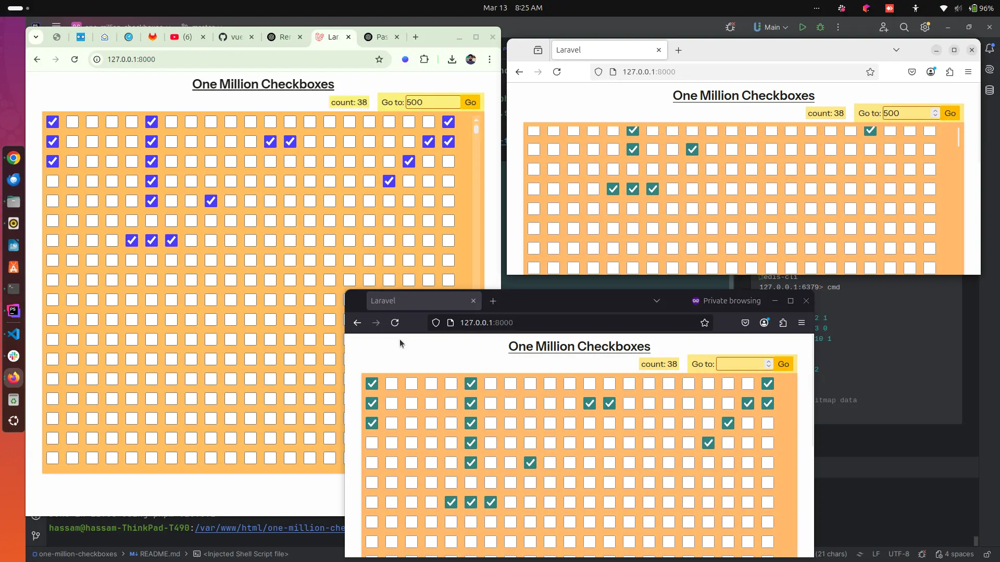

### Start reverb
```shell
php artisan reverb:start --debug
```

### Redis bitmap
I used redis bitmap for million records sync.

php extension `sudo apt-get install redis php8.2-redis`
restart `sudo systemctl restart php8.2-fpm.service`

`https://redis.io/docs/latest/develop/data-types/bitmaps/`
```shell
redis-cli
127.0.0.1:6379> cmd

# set bit
setbit state 2 1
setbit state 3 0
setbit state 10 1

#get-bit
getbit state 2
getbit state

# clean all bitmap data
FLUSHALL
```

### preview


web sockets


#### video


